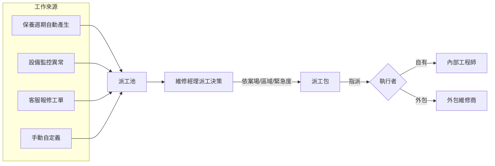
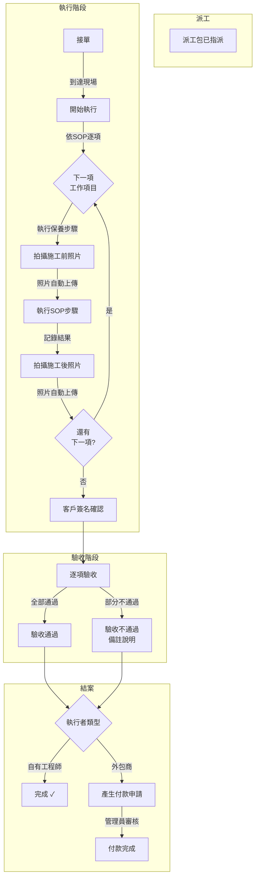
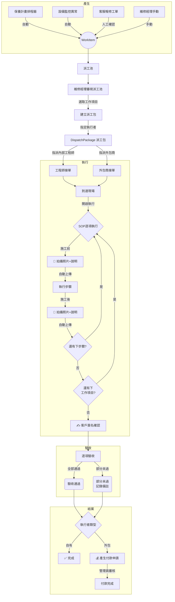

# 太陽能儲能監控系統 — Phase 2 需求規劃

**版本：** v0.5 草案
**日期：** 2026-05-06
**作者：** Hermes Agent

---

> ✅ **已確認事項（2026-05-06）：**
> - 客戶簽名方式：觸控螢幕（Canvas 簽名板）
> - 照片儲存：本地檔案系統
> - 外包付款：支援固定費率、依工時、依項目多種計價方式

---

## 目錄

1. [功能範圍](#1-功能範圍)
2. [核心流程](#2-核心流程)
3. [實體關係圖](#3-實體關係圖)
4. [資料庫模型](#4-資料庫模型)
5. [API 路由設計](#5-api-路由設計)
6. [前端頁面規劃](#6-前端頁面規劃)
7. [工程師排班邏輯](#7-工程師排班邏輯)
8. [實作優先序](#8-實作優先序)
9. [待確認事項](#9-待確認事項)

---

## 1. 功能範圍

### 1.1 客戶管理（Customer Management）

| 功能 | 說明 |
|------|------|
| 客戶列表 | 查詢、篩選、分頁顯示所有客戶 |
| 客戶新增/編輯 | 公司名稱、統一編號、聯絡人、電話、Email、地址 |
| 客戶詳情 | 客戶基本資料 + 名下案場列表 + 歷史工單 |
| 客戶搜尋 | 依名稱、統編、聯絡人關鍵字搜尋 |

### 1.2 案場管理（Site Management）

| 功能 | 說明 |
|------|------|
| 案場列表 | 依客戶篩選、依狀態篩選、關鍵字搜尋 |
| 案場新增/編輯 | 案場代號（自動產生）、名稱、種類、地址、座標、總容量(kWp)、安裝日期、狀態 |
| 案場詳情 | 基本資料 + 設備一覽 + 單元總覽 + 近期警報/派工 + 即時發電數據 |
| 案場狀態管理 | 運轉中 / 停機 / 建置中 |

### 1.3 設備與單元管理（Device & Unit Management）

| 功能 | 說明 |
|------|------|
| 設備列表 | 依案場篩選，顯示該案場下所有設備 |
| 設備新增/編輯 | 設備代號（自動產生）、類型、廠牌、型號、規格、安裝日期 |
| 設備詳情 | 設備資訊 + 組成單元列表 |
| 單元管理 | 在設備下新增/編輯/刪除單元 |
| 單元詳情 | 單元規格 + 綁定的保養項目列表 |

### 1.4 保養計畫管理（Maintenance Plan）

| 功能 | 說明 |
|------|------|
| 保養項目列表 | 依單元篩選，顯示所有保養項目 |
| 保養項目新增/編輯 | 項目名稱、保養週期、保養步驟（有序清單）、驗收標準 |
| 保養週期設定 | 支援：每週/每月/每季/每半年/每年，可設定頻率值 |
| 保養步驟編輯器 | 有序步驟，每步含描述、預估工時、所需工具 |
| 驗收標準編輯器 | 多項標準，每項含檢查項目、合格條件、量測範圍 |

### 1.5 派工管理（Dispatch Management）

| 功能 | 說明 |
|------|------|
| **工作項目產生** | 四種來源自動/手動產生工作項目 |
| **派工池** | 所有未派工的工作項目集中管理 |
| **派工包管理** | 維修經理將多個工作項目組合成派工包 |
| **派工包派發** | 選派工程師/外包商、設定預計執行日期 |
| **智慧建議** | 依案場位置、鄰近性、緊急程度建議最佳派工組合 |

#### 1.5.1 工作項目四種來源



### 1.6 維修執行管理（Execution Management）

| 功能 | 說明 |
|------|------|
| **執行者管理** | 內部工程師 + 外包維修商（支援廠商資料管理） |
| **接單流程** | 執行者收到派工包通知 → 確認接單 → 開始執行 |
| **SOP 引導執行** | 依保養步驟逐項顯示，每步驟可記錄結果與拍攝照片 |
| **施工照片管理** | 施工前/施工後照片自動上傳，附文字說明 |
| **客戶簽名確認** | 現場請客戶或案場負責人簽名確認 |
| **驗收管理** | 依驗收標準逐項檢查，記錄通過/不通過 |
| **外包付款程序** | 外包商完成後自動產生付款申請，管理員審核付款 |

#### 1.6.1 執行完整流程



#### 1.6.2 外包商付款流程

```
外包商完成派工包驗收
       ↓
系統自動產生付款申請
  (含：派工包編號、工作項目清單、金額)
       ↓
財務/管理員審核
       ↓
付款執行（轉帳/支票）
       ↓
標記已付款，更新付款紀錄
```

---

## 2. 核心流程 — 派工到執行完整生命週期



---

## 3. 實體關係圖

```mermaid
erDiagram
    CUSTOMER ||--o{ SITE : has
    SITE ||--o{ DEVICE : contains
    DEVICE ||--o{ UNIT : composed_of
    UNIT ||--o{ MAINTENANCE_ITEM : has_plan
    
    ALERT ||--o{ WORK_ITEM : triggers
    TICKET ||--o{ WORK_ITEM : triggers
    MAINTENANCE_ITEM ||--o{ WORK_ITEM : generates
    WORK_ITEM ||--o{ DISPATCH_PACKAGE_ITEM : belongs_to
    DISPATCH_PACKAGE_ITEM ||--o{ DISPATCH_PACKAGE : grouped_in
    
    DISPATCH_PACKAGE ||--o{ EXECUTION_RECORD : executes
    EXECUTION_RECORD ||--o{ EXECUTION_PHOTO : has_photos
    WORK_ITEM ||--o{ EXECUTION_PHOTO : documents
    
    EXECUTION_RECORD ||--o{ ENGINEER : performed_by
    EXECUTION_RECORD ||--o{ CONTRACTOR : outsourced_to
    
    EXECUTION_RECORD ||--o{ PAYMENT_RECORD : generates
    
    ENGINEER ||--o{ ENGINEER_SCHEDULE : scheduled
    
    CUSTOMER {
        int id PK
        string code
        string name
        string tax_id
        string contact_person
        string phone
        string email
        string address
        string status
    }
    
    SITE {
        int id PK
        string code
        int customer_id FK
        string name
        string site_type
        string address
        float latitude
        float longitude
        float capacity_kwp
        date installed_date
        string status
    }
    
    DEVICE {
        int id PK
        string code
        int site_id FK
        string name
        string device_type
        string status
        string manufacturer
        string model
        json specifications
        date installed_date
    }
    
    UNIT {
        int id PK
        int device_id FK
        string code
        string name
        string unit_type
        json specifications
        string status
    }
    
    MAINTENANCE_ITEM {
        int id PK
        int unit_id FK
        string name
        string frequency_type
        int frequency_value
        json steps
        json acceptance_criteria
        int estimated_minutes
        boolean is_active
    }
    
    WORK_ITEM {
        int id PK
        string source_type
        int source_id
        string title
        string description
        string priority
        int site_id FK
        int device_id FK
        int unit_id FK
        int maintenance_item_id FK
        string status
        int estimated_minutes
        int actual_minutes
        json result
        string result_notes
        timestamp completed_at
    }
    
    DISPATCH_PACKAGE {
        int id PK
        string package_code
        string title
        int engineer_id FK
        string status
        string priority
        date scheduled_date
        date completed_date
        string notes
        int created_by FK
        string executor_type
        int contractor_id FK
    }
    
    DISPATCH_PACKAGE_ITEM {
        int id PK
        int package_id FK
        int work_item_id FK
        int sort_order
    }
    
    EXECUTION_RECORD {
        int id PK
        int dispatch_package_id FK
        string executor_type
        int executor_id FK
        string status
        timestamp accepted_at
        timestamp started_at
        timestamp completed_at
        string customer_name
        string customer_signature
        timestamp signed_at
        string acceptance_status
        string acceptance_notes
        timestamp accepted_at
    }
    
    EXECUTION_PHOTO {
        int id PK
        int execution_record_id FK
        int work_item_id FK
        int step_order
        string photo_type
        string file_path
        string description
        timestamp uploaded_at
    }
    
    CONTRACTOR {
        int id PK
        string name
        string contact_person
        string phone
        string email
        string tax_id
        boolean is_active
        string bank_name
        string bank_account
    }
    
    PAYMENT_RECORD {
        int id PK
        int execution_record_id FK
        int contractor_id FK
        decimal amount
        string status
        string invoice_number
        date invoice_date
        date paid_date
        string notes
    }
    
    ENGINEER {
        int id PK
        string employee_id
        string full_name
        string phone
        string email
        string shift_group
        boolean is_active
    }
    
    ENGINEER_SCHEDULE {
        int id PK
        int engineer_id FK
        date work_date
        string shift
        string note
    }
```



---

## 4. 資料庫模型

### 4.1 客戶（customers）

```sql
CREATE TABLE customers (
    id SERIAL PRIMARY KEY,
    code VARCHAR(20) UNIQUE NOT NULL,
    name VARCHAR(200) NOT NULL,
    tax_id VARCHAR(20),
    contact_person VARCHAR(100),
    phone VARCHAR(50),
    email VARCHAR(200),
    address TEXT,
    status VARCHAR(20) DEFAULT 'active',
    created_at TIMESTAMP DEFAULT CURRENT_TIMESTAMP,
    updated_at TIMESTAMP DEFAULT CURRENT_TIMESTAMP
);
```

### 4.2 案場（sites）

```sql
CREATE TABLE sites (
    id SERIAL PRIMARY KEY,
    code VARCHAR(30) UNIQUE NOT NULL,
    customer_id INTEGER REFERENCES customers(id) ON DELETE CASCADE,
    name VARCHAR(200) NOT NULL,
    site_type VARCHAR(50) NOT NULL,
    address TEXT,
    latitude DECIMAL(10, 7),
    longitude DECIMAL(10, 7),
    capacity_kwp DECIMAL(10, 2),
    installed_date DATE,
    status VARCHAR(20) DEFAULT 'active',
    created_at TIMESTAMP DEFAULT CURRENT_TIMESTAMP,
    updated_at TIMESTAMP DEFAULT CURRENT_TIMESTAMP
);
```

### 4.3 設備（devices — 擴充）

```sql
ALTER TABLE devices ADD COLUMN site_id INTEGER REFERENCES sites(id) ON DELETE SET NULL;
ALTER TABLE devices ADD COLUMN code VARCHAR(50);
ALTER TABLE devices ADD COLUMN manufacturer VARCHAR(100);
ALTER TABLE devices ADD COLUMN model VARCHAR(100);
ALTER TABLE devices ADD COLUMN installed_date DATE;
```

### 4.4 單元（units）

```sql
CREATE TABLE units (
    id SERIAL PRIMARY KEY,
    device_id INTEGER NOT NULL REFERENCES devices(id) ON DELETE CASCADE,
    code VARCHAR(50) NOT NULL,
    name VARCHAR(200) NOT NULL,
    unit_type VARCHAR(50) NOT NULL,
    specifications JSONB,
    status VARCHAR(20) DEFAULT 'active',
    created_at TIMESTAMP DEFAULT CURRENT_TIMESTAMP,
    updated_at TIMESTAMP DEFAULT CURRENT_TIMESTAMP
);
```

### 4.5 保養項目（maintenance_items）

```sql
CREATE TABLE maintenance_items (
    id SERIAL PRIMARY KEY,
    unit_id INTEGER NOT NULL REFERENCES units(id) ON DELETE CASCADE,
    name VARCHAR(200) NOT NULL,
    frequency_type VARCHAR(20) NOT NULL,
    frequency_value INTEGER NOT NULL DEFAULT 1,
    steps JSONB,
    acceptance_criteria JSONB,
    estimated_minutes INTEGER,
    is_active BOOLEAN DEFAULT true,
    created_at TIMESTAMP DEFAULT CURRENT_TIMESTAMP,
    updated_at TIMESTAMP DEFAULT CURRENT_TIMESTAMP
);
```

**steps JSON 格式：**
```json
[
  {"order": 1, "description": "關閉設備電源並確認斷電", "est_min": 5, "tools": ["驗電筆"]},
  {"order": 2, "description": "拆開散熱風扇外蓋", "est_min": 3, "tools": ["螺絲起子組"]},
  {"order": 3, "description": "清潔風扇葉片與散熱鰭片", "est_min": 10, "tools": ["壓縮空氣罐"]},
  {"order": 4, "description": "檢查軸承運轉是否順暢", "est_min": 5},
  {"order": 5, "description": "組裝回原位並測試運轉", "est_min": 5, "tools": ["螺絲起子組"]}
]
```

**acceptance_criteria JSON 格式：**
```json
[
  {"order": 1, "item": "風扇運轉無異音", "condition": "normal", "range": null},
  {"order": 2, "item": "散熱鰭片無阻塞", "condition": "clean", "range": null},
  {"order": 3, "item": "運轉電流", "condition": "range", "range": {"min": 0.5, "max": 1.2, "unit": "A"}}
]
```

### 4.6 工作項目（work_items）

```sql
CREATE TABLE work_items (
    id SERIAL PRIMARY KEY,
    source_type VARCHAR(20) NOT NULL,          -- maintenance_plan / device_alert / customer_ticket / manual
    source_id INTEGER,
    title VARCHAR(200) NOT NULL,
    description TEXT,
    priority VARCHAR(20) NOT NULL DEFAULT 'medium',
    site_id INTEGER REFERENCES sites(id),
    device_id INTEGER REFERENCES devices(id),
    unit_id INTEGER REFERENCES units(id),
    maintenance_item_id INTEGER REFERENCES maintenance_items(id),
    status VARCHAR(20) NOT NULL DEFAULT 'pending',  -- pending / in_pool / assigned / in_progress / completed / cancelled
    estimated_minutes INTEGER,
    actual_minutes INTEGER,
    result JSONB,
    result_notes TEXT,
    completed_at TIMESTAMP,
    created_at TIMESTAMP DEFAULT CURRENT_TIMESTAMP,
    updated_at TIMESTAMP DEFAULT CURRENT_TIMESTAMP
);

CREATE INDEX idx_work_items_status ON work_items(status);
CREATE INDEX idx_work_items_source ON work_items(source_type, source_id);
CREATE INDEX idx_work_items_site ON work_items(site_id);
CREATE INDEX idx_work_items_priority ON work_items(priority);
```

### 4.7 派工包（dispatch_packages）

```sql
CREATE TABLE dispatch_packages (
    id SERIAL PRIMARY KEY,
    package_code VARCHAR(50) UNIQUE NOT NULL,
    title VARCHAR(200),
    executor_type VARCHAR(20) NOT NULL DEFAULT 'internal',  -- internal / contractor
    engineer_id INTEGER REFERENCES engineers(id),
    contractor_id INTEGER REFERENCES contractors(id),
    status VARCHAR(20) DEFAULT 'draft',        -- draft / assigned / accepted / in_progress / awaiting_acceptance / completed / cancelled
    priority VARCHAR(20) DEFAULT 'medium',
    scheduled_date DATE,
    completed_date DATE,
    notes TEXT,
    created_by INTEGER REFERENCES users(id),
    created_at TIMESTAMP DEFAULT CURRENT_TIMESTAMP,
    updated_at TIMESTAMP DEFAULT CURRENT_TIMESTAMP
);

CREATE INDEX idx_dp_status ON dispatch_packages(status);
CREATE INDEX idx_dp_engineer ON dispatch_packages(engineer_id);
CREATE INDEX idx_dp_contractor ON dispatch_packages(contractor_id);
CREATE INDEX idx_dp_date ON dispatch_packages(scheduled_date);
```

### 4.8 派工包項目（dispatch_package_items）

```sql
CREATE TABLE dispatch_package_items (
    id SERIAL PRIMARY KEY,
    package_id INTEGER NOT NULL REFERENCES dispatch_packages(id) ON DELETE CASCADE,
    work_item_id INTEGER NOT NULL REFERENCES work_items(id) ON DELETE CASCADE,
    sort_order INTEGER DEFAULT 0,
    UNIQUE(package_id, work_item_id)
);
```

### 4.9 執行紀錄（execution_records）

```sql
CREATE TABLE execution_records (
    id SERIAL PRIMARY KEY,
    dispatch_package_id INTEGER NOT NULL REFERENCES dispatch_packages(id),
    executor_type VARCHAR(20) NOT NULL,         -- internal / contractor
    
    -- 執行流程
    status VARCHAR(20) NOT NULL DEFAULT 'pending',
        -- pending / accepted / in_progress / awaiting_acceptance / completed / cancelled
    accepted_at TIMESTAMP,
    started_at TIMESTAMP,
    completed_at TIMESTAMP,
    
    -- 客戶簽名
    customer_name VARCHAR(200),
    customer_signature TEXT,                    -- 簽名圖片路徑或 base64
    signed_at TIMESTAMP,
    
    -- 驗收
    acceptance_status VARCHAR(20),               -- passed / partial / failed
    acceptance_notes TEXT,
    accepted_at TIMESTAMP,
    
    created_at TIMESTAMP DEFAULT CURRENT_TIMESTAMP,
    updated_at TIMESTAMP DEFAULT CURRENT_TIMESTAMP
);

CREATE INDEX idx_er_dispatch ON execution_records(dispatch_package_id);
CREATE INDEX idx_er_status ON execution_records(status);
```

### 4.10 執行照片（execution_photos）

```sql
CREATE TABLE execution_photos (
    id SERIAL PRIMARY KEY,
    execution_record_id INTEGER NOT NULL REFERENCES execution_records(id) ON DELETE CASCADE,
    work_item_id INTEGER REFERENCES work_items(id),    -- 關聯到哪個工作項目
    step_order INTEGER,                                  -- 對應到 SOP 第幾步驟
    photo_type VARCHAR(20) NOT NULL,                     -- before / after / signature / acceptance / other
    file_path TEXT NOT NULL,                             -- 檔案路徑
    description TEXT,                                    -- 照片說明
    uploaded_at TIMESTAMP DEFAULT CURRENT_TIMESTAMP
);

CREATE INDEX idx_ep_record ON execution_photos(execution_record_id);
CREATE INDEX idx_ep_work_item ON execution_photos(work_item_id);
```

### 4.11 外包維修商（contractors）

```sql
CREATE TABLE contractors (
    id SERIAL PRIMARY KEY,
    name VARCHAR(200) NOT NULL,                  -- 公司名稱
    contact_person VARCHAR(100),                 -- 聯絡人
    phone VARCHAR(50),                           -- 聯絡電話
    email VARCHAR(200),                          -- Email
    address TEXT,
    tax_id VARCHAR(20),                          -- 統一編號
    is_active BOOLEAN DEFAULT true,
    
    -- 付款資訊
    bank_name VARCHAR(200),                      -- 銀行名稱
    bank_account VARCHAR(100),                   -- 銀行帳號
    
    created_at TIMESTAMP DEFAULT CURRENT_TIMESTAMP,
    updated_at TIMESTAMP DEFAULT CURRENT_TIMESTAMP
);
```

### 4.12 付款紀錄（payment_records）

```sql
CREATE TABLE payment_records (
    id SERIAL PRIMARY KEY,
    execution_record_id INTEGER NOT NULL REFERENCES execution_records(id),
    contractor_id INTEGER NOT NULL REFERENCES contractors(id),
    amount DECIMAL(10, 2) NOT NULL,              -- 付款金額
    status VARCHAR(20) NOT NULL DEFAULT 'pending',  -- pending_approval / approved / paid / cancelled
    invoice_number VARCHAR(100),                  -- 發票號碼
    invoice_date DATE,                            -- 發票日期
    paid_date DATE,                               -- 付款日期
    notes TEXT,                                    -- 備註
    created_by INTEGER REFERENCES users(id),
    created_at TIMESTAMP DEFAULT CURRENT_TIMESTAMP,
    updated_at TIMESTAMP DEFAULT CURRENT_TIMESTAMP
);

CREATE INDEX idx_pr_contractor ON payment_records(contractor_id);
CREATE INDEX idx_pr_status ON payment_records(status);
```

### 4.13 客服工程師（engineers）

```sql
CREATE TABLE engineers (
    id SERIAL PRIMARY KEY,
    user_id INTEGER REFERENCES users(id),
    employee_id VARCHAR(20) UNIQUE NOT NULL,
    full_name VARCHAR(100) NOT NULL,
    phone VARCHAR(50),
    email VARCHAR(200),
    shift_group VARCHAR(10) NOT NULL,             -- day / night / backup
    is_active BOOLEAN DEFAULT true,
    created_at TIMESTAMP DEFAULT CURRENT_TIMESTAMP,
    updated_at TIMESTAMP DEFAULT CURRENT_TIMESTAMP
);
```

### 4.14 排班表（engineer_schedules）

```sql
CREATE TABLE engineer_schedules (
    id SERIAL PRIMARY KEY,
    engineer_id INTEGER REFERENCES engineers(id) ON DELETE CASCADE,
    work_date DATE NOT NULL,
    shift VARCHAR(10) NOT NULL,                   -- day / night / backup
    note TEXT,
    created_at TIMESTAMP DEFAULT CURRENT_TIMESTAMP,
    UNIQUE(engineer_id, work_date)
);

CREATE INDEX idx_es_date ON engineer_schedules(work_date);
```

---

## 4A. 技術實作備註

### 4A.1 施工照片儲存架構

```
本地檔案系統路徑規則：

  /app/uploads/photos/{execution_id}/{work_item_id}/{step_order}_{photo_type}_{timestamp}.jpg

  範例：
  /app/uploads/photos/42/3/2_before_20260610_103022.jpg
  /app/uploads/photos/42/3/2_after_20260610_104115.jpg

API 提供上傳端點（multipart/form-data）：
  POST /api/executions/:id/photos
    body: { work_item_id, step_order, photo_type, file, description }

檔案提供端點：
  GET /api/uploads/photos/{path}  → 靜態檔案服務
```

**目錄結構自動建立**：上傳時若目錄不存在則自動建立。

### 4A.2 觸控螢幕簽名實作

```html
<!-- 前端 Canvas 簽名板組件 -->
- 使用 HTML Canvas 實作簽名板
- 支援觸控事件（touchstart / touchmove / touchend）
- 支援滑鼠事件（mousedown / mousemove / mouseup）
- 清除/重簽按鈕
- 提交後將 Canvas 轉為 PNG base64 或上傳為圖片

資料庫儲存：
  execution_records.customer_signature → TEXT (圖片路徑)
  簽名圖片儲存路徑：/app/uploads/signatures/{execution_id}_signature.png
```

### 4A.3 外包付款計價方式

支援三種計價模式（在 dispatch_packages 或 payment_records 記錄）：

| 模式 | 說明 | 儲存方式 |
|------|------|----------|
| 固定費率 | 每包固定金額 | payment_records.amount |
| 依工時計價 | 每小時單價 × 實際工時 | payment_records + job_hours, hourly_rate 欄位 |
| 依項目計價 | 每項目單價 × 項目數量 | 明細以 JSON 存入 payment_records.notes |

擴充 `payment_records` 欄位：
```sql
ALTER TABLE payment_records ADD COLUMN pricing_type VARCHAR(20);  -- fixed / hourly / itemized
ALTER TABLE payment_records ADD COLUMN hourly_rate DECIMAL(10, 2);
ALTER TABLE payment_records ADD COLUMN total_hours DECIMAL(5, 1);
ALTER TABLE payment_records ADD COLUMN items JSONB;  -- [{name, qty, unit_price}]
```
 API 路由設計

### 5.1 客戶（Customers）

| 方法 | 路由 | 說明 |
|------|------|------|
| GET | `/api/customers` | 列表（搜尋、分頁） |
| GET | `/api/customers/:id` | 詳情 |
| GET | `/api/customers/:id/sites` | 名下案場 |
| POST | `/api/customers` | 新增 |
| PUT | `/api/customers/:id` | 編輯 |
| DELETE | `/api/customers/:id` | 刪除 |

### 5.2 案場（Sites）

| 方法 | 路由 | 說明 |
|------|------|------|
| GET | `/api/sites` | 列表 |
| GET | `/api/sites/:id` | 詳情 |
| GET | `/api/sites/:id/devices` | 設備 |
| GET | `/api/sites/:id/alerts` | 警報 |
| GET | `/api/sites/:id/work-items` | 工作項目 |
| POST | `/api/sites` | 新增 |
| PUT | `/api/sites/:id` | 編輯 |
| PUT | `/api/sites/:id/status` | 狀態變更 |
| DELETE | `/api/sites/:id` | 刪除 |

### 5.3 設備（Devices）

| 方法 | 路由 | 說明 |
|------|------|------|
| GET | `/api/sites/:siteId/devices` | 案場下設備 |
| POST | `/api/sites/:siteId/devices` | 新增 |
| GET | `/api/devices/:id` | 詳情 |
| PUT | `/api/devices/:id` | 編輯 |
| PUT | `/api/devices/:id/site` | 變更所屬 |

### 5.4 單元（Units）

| 方法 | 路由 | 說明 |
|------|------|------|
| GET | `/api/devices/:deviceId/units` | 設備下單元 |
| POST | `/api/devices/:deviceId/units` | 新增 |
| GET | `/api/units/:id` | 詳情 |
| PUT | `/api/units/:id` | 編輯 |
| DELETE | `/api/units/:id` | 刪除 |

### 5.5 保養項目（Maintenance Items）

| 方法 | 路由 | 說明 |
|------|------|------|
| GET | `/api/units/:unitId/items` | 單元下保養項目 |
| POST | `/api/units/:unitId/items` | 新增 |
| GET | `/api/maintenance-items/:id` | 詳情 |
| PUT | `/api/maintenance-items/:id` | 編輯 |
| DELETE | `/api/maintenance-items/:id` | 刪除 |

### 5.6 工作項目（Work Items）

| 方法 | 路由 | 說明 |
|------|------|------|
| GET | `/api/work-items` | 列表（可篩選） |
| GET | `/api/work-items/pool` | 派工池 |
| GET | `/api/work-items/:id` | 詳情 |
| POST | `/api/work-items` | 手動新增 |
| PUT | `/api/work-items/:id` | 編輯 |
| PUT | `/api/work-items/:id/status` | 狀態變更 |
| POST | `/api/work-items/generate` | 觸發保養自動產生 |
| DELETE | `/api/work-items/:id` | 刪除 |

### 5.7 派工包（Dispatch Packages）

| 方法 | 路由 | 說明 |
|------|------|------|
| GET | `/api/dispatch-packages` | 列表 |
| GET | `/api/dispatch-packages/:id` | 詳情（含所含項目） |
| POST | `/api/dispatch-packages` | 建立 |
| POST | `/api/dispatch-packages/suggest` | 組合建議 |
| PUT | `/api/dispatch-packages/:id` | 編輯 |
| PUT | `/api/dispatch-packages/:id/assign` | 變更執行者 |
| PUT | `/api/dispatch-packages/:id/status` | 狀態變更 |
| DELETE | `/api/dispatch-packages/:id` | 刪除 |

### 5.8 維修執行（Execution）

| 方法 | 路由 | 說明 |
|------|------|------|
| GET | `/api/executions` | 執行紀錄列表 |
| GET | `/api/executions/:id` | 執行詳情（含照片） |
| PUT | `/api/executions/:id/accept` | 接單 |
| PUT | `/api/executions/:id/start` | 開始執行 |
| PUT | `/api/executions/:id/step` | 回報步驟進度 |
| POST | `/api/executions/:id/photos` | 上傳施工照片 |
| PUT | `/api/executions/:id/sign` | 客戶簽名 |
| PUT | `/api/executions/:id/acceptance` | 提交驗收結果 |
| PUT | `/api/executions/:id/complete` | 完成執行 |
| GET | `/api/executions/:id/photos` | 取得所有照片 |

### 5.9 外包維修商（Contractors）

| 方法 | 路由 | 說明 |
|------|------|------|
| GET | `/api/contractors` | 列表 |
| GET | `/api/contractors/:id` | 詳情 |
| POST | `/api/contractors` | 新增 |
| PUT | `/api/contractors/:id` | 編輯 |
| PUT | `/api/contractors/:id/status` | 啟用/停用 |

### 5.10 付款（Payments）

| 方法 | 路由 | 說明 |
|------|------|------|
| GET | `/api/payments` | 付款列表 |
| GET | `/api/payments/:id` | 詳情 |
| POST | `/api/payments` | 新增付款申請 |
| PUT | `/api/payments/:id/approve` | 核准付款 |
| PUT | `/api/payments/:id/pay` | 標記已付款 |
| PUT | `/api/payments/:id/reject` | 駁回 |

### 5.11 工程師（Engineers）

| 方法 | 路由 | 說明 |
|------|------|------|
| GET | `/api/engineers` | 列表 |
| GET | `/api/engineers/:id` | 詳情 |
| GET | `/api/engineers/:id/schedule` | 個人班表 |
| GET | `/api/engineers/:id/packages` | 個人派工包 |
| POST | `/api/engineers` | 新增 |
| PUT | `/api/engineers/:id` | 編輯 |
| PUT | `/api/engineers/:id/status` | 啟用/停用 |
| DELETE | `/api/engineers/:id` | 刪除 |

### 5.12 排班（Schedules）

| 方法 | 路由 | 說明 |
|------|------|------|
| GET | `/api/schedules?month=2026-06` | 月排班表 |
| GET | `/api/schedules/today` | 今日值班 |
| POST | `/api/schedules/generate` | 自動產生 |
| POST | `/api/schedules` | 手動新增 |
| PUT | `/api/schedules/:id` | 編輯 |
| DELETE | `/api/schedules/:id` | 刪除 |
| POST | `/api/schedules/swap` | 換班申請 |

---

## 6. 前端頁面規劃

### 6.1 側邊導航

```
📊 儀表板
🏢 客戶管理
├─ 客戶列表
🔌 案場管理
├─ 案場總覽
├─ 設備列表
├─ 單元管理
📋 保養計畫
├─ 保養項目清單
├─ 保養日曆
📦 派工管理              ← 核心
├─ 📥 派工池
├─ 📋 派工包列表
├─ ➕ 新增派工包
├─ ▶️ 執行中             ← 新增
├─ ✅ 已完成
👨‍🔧 外包商管理            ← 新增
├─ 外包商列表
├─ 付款管理
🔔 警報中心
📋 工單系統
👨‍🔧 戰情中心
├─ 值班日曆
├─ 工程師管理
├─ 排班設定
```

### 6.2 派工池頁面

```
┌─────────────────────────────────────────────────────┐
│ 📥 派工池                    [+ 新增工作項目]        │
│                                                       │
│ [全部] [待處理] [已指派] [依案場▼] [依優先級▼]       │
│───────────────────────────────────────────────────────│
│                                                       │
│ 🔴 high  │ 逆變器A 散熱風扇清潔                     │
│ 案場: 內湖科技廠 │ 來源: 保養計畫 │ 到期: 06/15    │
│ [選取] [詳情]                                         │
│                                                       │
│ 🟡 medium│ 太陽能板陣列B 效率檢測                    │
│ 案場: 桃園物流中心│ 來源: 設備異常 │ 到期: 06/18    │
│ [選取] [詳情]                                         │
│                                                       │
│ ───────────────────────────────────────────────────── │
│ 已選取 3 項  [建立派工包]  [💡 智慧建議派工組合]       │
└─────────────────────────────────────────────────────┘
```

### 6.3 建立派工包

```
┌─────────────────────────────────────────────────────┐
│ ✏️ 新建派工包                                         │
│──────────────────────────────────────────────────────│
│ 標題: [內湖科技廠 Q2 保養派工]                       │
│ 優先級: [⚡ 一般 ▼]                                   │
│ 預計日期: [2026-06-10]                                │
│ 執行者類型: [● 內部工程師  ○ 外包商]                  │
│ 指派對象: [王大明 ▼]                                  │
│                                                       │
│ ── 工作項目（3 項） ──                               │
│ # │ 優先│ 工作項目              │ 案場    │ 工時   │
│ 1 │ 🔴 │ 逆變器A 散熱風扇清潔   │ 內湖   │ 60分   │
│ 2 │ 🟢 │ 電池櫃年度測試         │ 內湖   │ 120分  │
│ 3 │ 🟡 │ 監控主機韌體更新       │ 內湖   │ 45分   │
│                                                       │
│ 備註: [請攜帶 19mm 板手及萬用電表]                    │
│                                                       │
│ [💾 儲存草稿]  [🚀 直接派發]  [取消]                  │
└─────────────────────────────────────────────────────┘
```

### 6.4 執行中 — 工程師視角

```
┌─────────────────────────────────────────────────────┐
│ ▶️ 執行中：內湖科技廠 Q2 保養派工                     │
│ 狀態: ● 執行中 │ 進度: 2/3 工作項目                   │
│──────────────────────────────────────────────────────│
│                                                       │
│ 📋 工作項目 1/3：逆變器A 散熱風扇清潔                │
│ ─────────────────────────────────────────────────── │
│                                                       │
│ SOP 步驟：                                            │
│                                                       │
│ ☑ 步驟1 關閉設備電源並確認斷電                       │
│    📸 [施工前照片已上傳] 斷電狀態確認                │
│                                                       │
│ ☑ 步驟2 拆開散熱風扇外蓋                             │
│    📸 [施工前照片已上傳] 外蓋拆開狀態                │
│                                                       │
│ ☐ 步驟3 清潔風扇葉片與散熱鰭片  ◀ 目前步驟          │
│    [📸 拍攝施工前] [📸 拍攝施工後]                    │
│    [✏️ 說明...]                                      │
│                                                       │
│ ☐ 步驟4 檢查軸承運轉是否順暢                         │
│ ☐ 步驟5 組裝回原位並測試運轉                         │
│                                                       │
│ [✅ 完成此工作項目]                                   │
└─────────────────────────────────────────────────────┘
```

### 6.5 客戶簽名與驗收

```
┌─────────────────────────────────────────────────────┐
│ ✍️ 客戶簽名確認                                       │
│──────────────────────────────────────────────────────│
│                                                       │
│ 案場：內湖科技廠 │ 日期：2026-06-10                   │
│                                                       │
│ 已完成工作項目：                                      │
│ ✅ 逆變器A 散熱風扇清潔                              │
│ ✅ 電池櫃年度電容量測試                              │
│ ✅ 監控主機韌體更新                                  │
│                                                       │
│ ── 簽名區域 ──                                       │
│ ┌────────────────────────────────────────┐           │
│ │                                        │           │
│ │        請在此區域簽名                   │           │
│ │                                        │           │
│ └────────────────────────────────────────┘           │
│                                                       │
│ 簽署人姓名: [林經理]                                 │
│                                                       │
│ [💾 確認簽名]                                         │
│                                                       │
│ ── 驗收 ──                                            │
│ 驗收結果: [● 全部通過 ○ 部分未過 ○ 未通過]           │
│ 備註: [________________________________]              │
│                                                       │
│ [📤 提交驗收]                                         │
└─────────────────────────────────────────────────────┘
```

### 6.6 外包商付款管理

```
┌─────────────────────────────────────────────────────┐
│ 💰 付款管理                                           │
│                                                       │
│ [待審核] [已核准] [已付款] [全部]                     │
│───────────────────────────────────────────────────────│
│                                                       │
│ 🟡 pending │ 內湖科技廠 Q2 保養派工                   │
│ 外包商: 永鑫機電 │ 金額: NT$ 45,000                  │
│ 發票: XY-20260601 │ 申請日: 2026-06-10              │
│ [核准] [拒絕] [詳情]                                  │
│                                                       │
│ 🟢 paid    │ 桃園物流中心 變流器維修                  │
│ 外包商: 永鑫機電 │ 金額: NT$ 12,000                  │
│ 發票: XY-20260515 │ 付款日: 2026-05-20              │
│ [詳情]                                                │
└─────────────────────────────────────────────────────┘
```

### 6.7 新增頁面總表

| 頁面 | 路由 | 說明 |
|------|------|------|
| 客戶列表 | `/customers` | |
| 客戶詳情 | `/customers/:id` | + 案場 |
| 案場總覽 | `/sites` | 卡片/地圖 |
| 案場詳情 | `/sites/:id` | + 設備+派工 |
| 設備詳情 | `/devices/:id` | 擴充：單元 |
| 單元詳情 | `/units/:id` | + 保養項目 |
| 保養項目編輯 | `/maintenance-items/:id` | 步驟/驗收編輯器 |
| 保養日曆 | `/maintenance-calendar` | |
| **派工池** | `/dispatch/pool` | 核心戰情頁 |
| **派工包列表** | `/dispatch/packages` | |
| **派工包編輯** | `/dispatch/packages/new` | |
| **派工包詳情** | `/dispatch/packages/:id` | |
| **執行中** | `/dispatch/active` | 進行中派工 |
| **執行詳情** | `/dispatch/executions/:id` | SOP+照片+簽名 |
| **外包商列表** | `/contractors` | CRUD |
| **付款管理** | `/payments` | 審核+付款 |
| 值班日曆 | `/command-center` | |
| 工程師管理 | `/engineers` | |
| 排班設定 | `/schedule` | |

---

## 7. 工程師排班邏輯

### 7.1 人員配置

| 角色 | 人員 | 班別 | 說明 |
|------|------|------|------|
| 日班輪值A | P1 | day (08-20) | 做2休2 |
| 日班輪值B | P2 | day (08-20) | 做2休2 |
| 夜班輪值A | P3 | night (20-08) | 做2休2 |
| 夜班輪值B | P4 | night (20-08) | 做2休2 |
| 常日備援 | P5 | backup (08-17) | 週一~五 |

### 7.2 做2休2 演算法

```
輸入：月份 (year, month), 人員清單
輸出：schedule 資料

1. 分組：day=[P1,P2], night=[P3,P4], backup=[P5]
2. day_group：(floor(i/2) % 2 === 0) ? P1 : P2
3. night_group 同理
4. backup 僅 weekday
5. 寫入 engineer_schedules
```

### 7.3 月排班範例

```
  June 2026
Mon 01  [日]P1  [夜]P3  [備]P5
Tue 02  [日]P1  [夜]P3  [備]P5
Wed 03  [日]P2  [夜]P4  [備]P5
Thu 04  [日]P2  [夜]P4  [備]P5
Fri 05  [日]P1  [夜]P3  [備]P5
Sat 06  [日]P1  [夜]P3  [休]
Sun 07  [日]P2  [夜]P4  [休]
...
```

---

## 8. 實作優先序

### Batch 1 — 後端資料模型

```
Step 1: Customer Entity + Service + Controller
Step 2: Site Entity + Service + Controller
Step 3: Device 擴充
Step 4: Unit Entity + Service + Controller
Step 5: MaintenanceItem Entity + Service + Controller
Step 6: WorkItem Entity + Service + Controller（含派工池）
Step 7: DispatchPackage + DispatchPackageItem
Step 8: ExecutionRecord + ExecutionPhoto
Step 9: Contractor + PaymentRecord
Step 10: Engineer + EngineerSchedule（含排班產生器）
Step 11: 更新 init.sql、種子資料、app.module.ts
```

### Batch 2 — 前端基礎頁面

```
Step 12: 客戶列表 + 客戶詳情
Step 13: 案場總覽 + 案場詳情
Step 14: 前端路由重組、側邊導航更新
Step 15: 設備詳情擴充（所屬案場+單元）
Step 16: 單元管理頁面
```

### Batch 3 — 保養計畫

```
Step 17: 保養項目列表 + 編輯器
Step 18: 保養日曆視圖
Step 19: 自動產生工作項目排程器
```

### Batch 4 — 派工核心

```
Step 20: 派工池頁面（篩選、批量選取）
Step 21: 建立派工包（選項+指派）
Step 22: 派工包列表+詳情
Step 23: 派工組合建議
```

### Batch 5 — 執行管理

```
Step 24: 執行中頁面（工程師視角）
Step 25: SOP 步驟引導 + 照片上傳
Step 26: 客戶簽名功能
Step 27: 驗收管理
```

### Batch 6 — 外包與付款

```
Step 28: 外包商管理 CRUD
Step 29: 付款管理頁面
Step 30: 付款流程（申請→審核→付款）
```

### Batch 7 — 戰情中心

```
Step 31: 工程師管理頁面
Step 32: 月排班表日曆
Step 33: 今日值班 Widget
Step 34: 儀表板擴充（派工統計、執行中數量）
```

---

## 9. 待確認事項

> ✅ **已確認（2026-05-06）：**
> - ~~客戶簽名方式：現場觸控螢幕簽名？平板？紙本拍照上傳？~~
>   → **觸控螢幕 Canvas 簽名板**
> - ~~照片檔案儲存：直接存伺服器檔案系統？還是需要 S3/物件儲存？~~
>   → **本地檔案系統**
> - ~~外包付款金額計算方式：固定費率？依工時？依項目計價？~~
>   → **三種都支援（pricing_type: fixed / hourly / itemized）**

- [ ] **設備類型縮寫**：PANEL / BATT / INVT / MON？
- [ ] **客戶代號格式**：`CUST-{流水號}` 或可自訂？
- [ ] **案場種類**：屋頂型、地面型、水面型、車棚型？
- [ ] **現有測試資料遷移**：5 台設備歸到哪個預設案場？
- [ ] **單元類型**有哪些？（cooling_fan, capacitor_bank, control_board...）
- [ ] **派工包大小**：一包幾個工作項目為宜？
- [ ] **同區域距離門檻**：多少 km 內視為同區域？
- [ ] **工程師是否須登入系統**？還是只由管理員操作？
