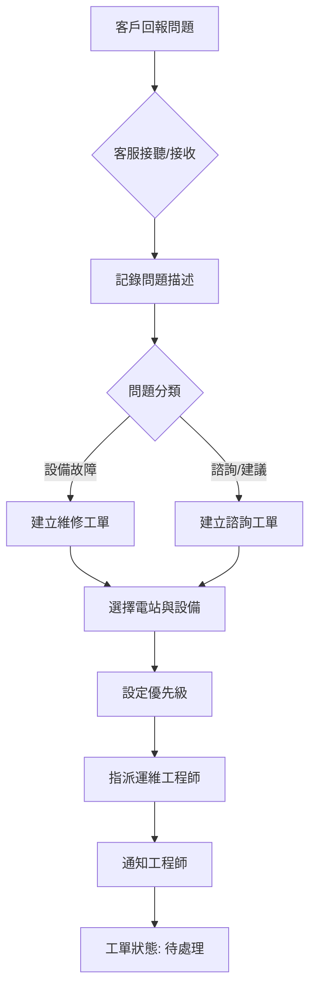

# 太陽能儲能管理系統 - 使用情境 A：客服轉派 (Desktop Wireframe)

**版本：** v1.0  
**日期：** 2026-04-30  
**作者：** Hermes Agent

---

## 1. 設計目標
模擬客服專員從「接收需求」到「建立並分派工單」的完整桌面端操作流程。

## 2. 業務流程圖 (Mermaid)



---

## 3. 介面佈局架構 (Layout)

- **Sidebar (左側導覽)**: 
    - `Dashboard` (儀表板)
    - `Work Orders` (工單管理 - **當前頁面**)
    - `Equipment` (設備監控)
    - `Customers` (客戶管理)
    - `Settings` (系統設定)
- **Header (頂部狀態列)**: 
    - `Breadcrumbs`: Work Orders / Create New
    - `Search Bar`: 全域搜尋
    - `User Profile`: 使用者頭像與名稱 (CS Admin)
- **Main Content Area (主內容區)**: 
    - 使用彈窗式設計 (Modal) 來處理「新建」動作，確保使用者不會迷失在頁面跳轉中。

---

## 4. ASCII Wireframe - 桌面端佈局示意圖

### 4.1 工單列表頁 (Work Order List View)

```
┌─────────────────────────────────────────────────────────────────────────────┐
│  ☰  Solar Storage Mgmt       [🔍 搜尋工單、設備...]          👤 CS Admin ▼ │
├──────────┬──────────────────────────────────────────────────────────────────┤
│          │  Work Orders > Create New                                        │
│ 📊 Dash- │                                                                  │
│   board  │  [+ Create New Work Order]  ──────────────────────────────────┐  │
│          │                                                                  │  │
│ 📋 Work  │  ┌─────────────┬───────────┬──────────┬─────────┬─────────┐   │  │
│   Orders │  │ ID          │ Subject   │ Customer │ Priority│ Status  │   │  │
│  ◀ ACTIVE│  ├─────────────┼───────────┼──────────┼─────────┼─────────┤   │  │
│          │  │ WO-20260430 │ Inverter  │ Green    │ 🔴 Urgent│ Open    │   │  │
│          │  │             │ Alarm     │ Energy   │         │         │   │  │
│ 📦 Equip-│  ├─────────────┼───────────┼──────────┼─────────┼─────────┤   │  │
│   ment   │  │ WO-20260429 │ Battery   │ Blue     │ 🟡 High  │ In Prog │   │  │
│          │  │             │ Temp H    │ Solar    │         │         │   │  │
│ 👥 Custom-│  ├─────────────┼───────────┼──────────┼─────────┼─────────┤   │  │
│   ers    │  │ WO-20260428 │ Grid      │ Red      │ 🟢 Norm  │ Closed  │   │  │
│          │  │             │ Flicker   │ Wind     │         │         │   │  │
│ ⚙️ Settings│  └─────────────┴───────────┴──────────┴─────────┴─────────┘   │  │
│          │                                                                  │  │
│          │  ┌────────────────────────────────────────────────────────────┐  │  │
│          │  │ [Filter: All] [Date Range ▼] [Plant ▼] [Priority ▼]       │  │  │
│          │  └────────────────────────────────────────────────────────────┘  │  │
│          │                                                                  │  │
│          │  Page 1 of 23    < 1 2 3 ... 23 >                                │  │
│          └──────────────────────────────────────────────────────────────────┤
└─────────────────────────────────────────────────────────────────────────────┘
```

### 4.2 新建工單彈窗 (Create Work-Order Modal)

```
┌─────────────────────────────────────────────────────────────┐
│  📝 Create New Work Order                            [X]    │
├─────────────────────────────────────────────────────────────┤
│                                                             │
│  ── Basic Information ──                                    │
│                                                             │
│  Title: [________________________________________]        │
│  (Required - Max 100 chars)                                 │
│                                                             │
│  Description:                                               │
│  ┌─────────────────────────────────────────────────────┐   │
│  │                                                     │   │
│  │                                                     │   │
│  │                                                     │   │
│  └─────────────────────────────────────────────────────┘   │
│  (Required - Min 20 chars)                                  │
│                                                             │
│  ── Context & Association ──                                │
│                                                             │
│  Plant:     [Green Energy Station Alpha       ▼]           │
│  Equipment: [Search or select equipment...        🔍]      │
│                                                             │
│  ── Priority & Metadata ──                                  │
│                                                             │
│  Priority:   (🔴 Urgent) (🟡 High) (🟢 Normal) (⚪ Low)    │
│  Created By: CS Admin (auto-filled)                         │
│                                                             │
│  ── Assignment ──                                           │
│                                                             │
│  Assign To: [Engineer Wang (Online)             ▼]         │
│                                                             │
│  Note:    [Enter dispatch instructions...          ]       │
│                                                             │
├─────────────────────────────────────────────────────────────┤
│  [Cancel]                                    [Create & Assign] │
└─────────────────────────────────────────────────────────────┘
```

---

## 5. 詳細介面元素設計 (Wireframe Details)

### 5.1 工單列表頁 (Work Order List View)
當使用者在 `Work Orders` 模組時，看到的預設畫面。

| 元素 | 設計說明 |
|------|----------|
| **Filter Bar** | 位於列表上方。包含：日期範圍選擇器、電站篩選下拉框、優先級篩選、狀態篩組。 |
| **Action Button** | 右上角顯眼的 `[+ Create New Work Order]` 藍色按鈕。 |
| **Data Table** | 核心列表，欄位包含：<br>1. `ID` (工單編號)<br>2. `Subject` (標題)<br>3. `Customer` (客戶名稱)<br>4. `Priority` (彩色標籤)<br>5. `Status` (狀態標籤)<br>6. `Actions` (編輯/詳情按鈕) |

### 5.2 新建工單彈窗 (Create Work-Order Modal)
點擊 `[+ Create New Work Order]` 後彈出的對話框。

#### **A. Header (標題區)**
- `[Icon] Create New Work Order`
- 右上角 `[X]` 關閉按鈕。

#### **B. Form Body (表單區)**
- **Section 1: Basic Information**
    - `Title`: 文字輸入框 (Required)
    - `Description`: 多行文字區域 (Textarea, Required)
- **Section 2: Context & Association**
    - `Plant`: 下拉選單 (從客戶名下自動載入電站)
    - `Equipment`: 搜尋式下拉選單 (與所選電站關聯)
- **Section 3: Priority & Metadata**
    - `Priority`: 四個按鈕組 (Urgent/High/Medium/Low)
    - `Created By`: 自動帶入當前使用者

#### **C. Assignment Section (分派區)**
- `Assign To`: 下拉選單，顯示目前在線或可用的「運維工程師」名單。
- `Note`: 備註欄位，用於輸入分派說明。

#### **D. Footer (底部按鈕區)**
- `[Cancel]`: 灰色邊框按鈕。
- `[Create & Assign]`: 藍色實心按鈕 (Primary Action)。

---

## 6. 使用者路徑模擬 (User Path)

1. **進入** → 登入系統 → 點擊左側 `Work Orders`。
2. **觸發** → 點擊右上角 `[+ Create New Work Order]`。
3. **輸入** → 填寫標題與描述 → 從下拉選單選擇電站與設備。
4. **分派** → 在 `Assign To` 選擇一名工程師。
5. **完成** → 點擊 `[Create & Assign]` → 彈窗關閉，回到列表頁並看到新產生的工單。

---
**文件結束**
