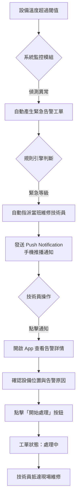

# 太陽能儲能管理系統 - 使用情境 B：告警觸發 (Mobile Wireframe)

**版本：** v1.0  
**日期：** 2026-04-30  
**作者：** Hermes Agent

---

## 1. 設計目標
模擬「系統自動告警」到「維修技術員行動端接收並處理」的完整行動端操作流程。

## 2. 業務流程圖 (Mermaid)



---

## 3. 行動端介面佈局架構 (Mobile Layout)

### 3.1 底部導覽列 (Bottom Navigation Bar)
行動端專用，支援單手操作：

| 圖示 | 功能 | 說明 |
|------|------|------|
| 🏠 | 首頁儀表板 | 即時監控概覽、告警總覽 |
| 📋 | 我的任務 | 已分派的工單列表 |
| 🔔 | 告警中心 | 所有告警訊息（紅色角標顯示數量） |
| 👤 | 個人中心 | 個人資料、設定 |

### 3.2 頂部狀態列 (Header)
- **左側**：漢堡選單圖示（可展開側邊欄）
- **中間**：頁面標題（如「告警中心」）
- **右側**：通知鈴鐺圖示（未讀數量角標）

---

## 4. ASCII Wireframe - 行動端介面模擬

### 4.1 手機通知推播 (Push Notification)
當系統產生緊急告警時，技術員的手機會收到以下推播：

```
┌─────────────────────────────────────┐
│  📱 手機鎖屏畫面 / 通知中心          │
├─────────────────────────────────────┤
│                                     │
│  ┌─────────────────────────────┐    │
│  │ 🔴 緊急告警！               │    │
│  │                             │    │
│  │ 設備：變流器 INV-A03         │    │
│  │ 電站：Green Energy Station   │    │
│  │ 溫度：87.5°C (閾值: 75°C)   │    │
│  │                             │    │
│  │ [ 立即處理 ]  [ 稍後提醒 ]   │    │
│  └─────────────────────────────┘    │
│                                     │
└─────────────────────────────────────┘
```

### 4.2 告警中心頁面 (Alert Center)
技術員打開 App 後看到的告警列表：

```
┌─────────────────────────────────────┐
│  ☰  告警中心              🔔 (3)    │
├─────────────────────────────────────┤
│                                     │
│  ── 緊急 (2) ──────────────────────  │
│                                     │
│  ┌─────────────────────────────────┐│
│  │ 🔴 CRITICAL                     ││
│  │ 變流器 INV-A03 溫度過高         ││
│  │ Green Energy Station - A區      ││
│  │ 2026-05-01 09:43                ││
│  │ [ 查看詳情 ]                    ││
│  └─────────────────────────────────┘│
│                                     │
│  ┌─────────────────────────────────┐│
│  │ 🔴 CRITICAL                     ││
│  │ 電池組 BAT-B07 電壓異常         ││
│  │ Blue Solar Park - B區           ││
│  │ 2026-05-01 09:38                ││
│  │ [ 查看詳情 ]                    ││
│  └─────────────────────────────────┘│
│                                     │
│  ── 警告 (1) ──────────────────────  │
│                                     │
│  ┌─────────────────────────────────┐│
│  │ 🟡 WARNING                      ││
│  │ 網關 GW-C01 通訊中斷            ││
│  │ Red Wind Farm - C區             ││
│  │ 2026-05-01 09:30                ││
│  │ [ 查看詳情 ]                    │