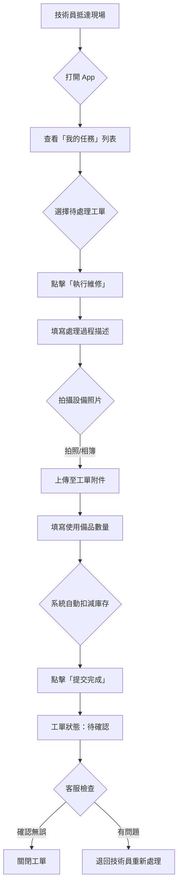

# 太陽能儲能管理系統 - 使用情境 C：現場維修 (Mobile Wireframe)

**版本：** v1.0  
**日期：** 2026-04-30  
**作者：** Hermes Agent

---

## 1. 設計目標
模擬「維修技術員抵達現場」到「完成維修並提交回報」的完整行動端操作流程。

## 2. 業務流程圖 (Mermaid)



---

## 3. 行動端介面佈局架構 (Mobile Layout)

### 3.1 底部導覽列 (Bottom Navigation Bar)
行動端專用，支援單手操作：

| 圖示 | 功能 | 說明 |
|------|------|------|
| 🏠 | 首頁儀表板 | 即時監控概覽、告警總覽 |
| 📋 | 我的任務 | 已分派的工單列表（**當前頁面**） |
| 🔔 | 告警中心 | 所有告警訊息（紅色角標顯示數量） |
| 👤 | 個人中心 | 個人資料、設定 |

### 3.2 頂部狀態列 (Header)
- **左側**：漢堡選單圖示（可展開側邊欄）
- **中間**：頁面標題（如「我的任務」）
- **右側**：通知鈴鐺圖示（未讀數量角標）

---

## 4. ASCII Wireframe - 行動端介面模擬

### 4.1 我的任務列表頁 (My Tasks List)
技術員打開 App 後看到的待處理工單：

```
┌─────────────────────────────────────┐
│  ☰  我的任務                🔔 (2)   │
├─────────────────────────────────────┤
│                                     │
│  ── 待處理 (2) ────────────────────  │
│                                     │
│  ┌─────────────────────────────────┐│
│  │ 🔴 CRITICAL                     ││
│  │ WO-20260430 - 變流器溫度過高    ││
│  │ Green Energy Station - A區      ││
│  │ 分派時間：2026-05-01 09:43      ││
│  │ [ 查看詳情 ]                    ││
│  └─────────────────────────────────┘│
│                                     │
│  ── 處理中 (1) ────────────────────  │
│                                     │
│  ┌─────────────────────────────────┐│
│  │ 🟡 IN PROGRESS                  ││
│  │ WO-20260429 - 電池模組更換      ││
│  │ Blue Solar Park - B區           ││
│  │ 開始時間：2026-05-01 08:30      ││
│  │ [ 繼續處理 ]                    ││
│  └─────────────────────────────────┘│
│                                     │
│  ── 已完成 (5) ────────────────────  │
│                                     │
│  [ 查看所有已完成任務 > ]           │
│                                     │
└─────────────────────────────────────┘
```

### 4.2 工單詳情頁 (Work Order Detail)
點擊「查看詳情」後看到的詳細資訊：

```
┌─────────────────────────────────────┐
│  ← 工單詳情                         │
├─────────────────────────────────────┤
│                                     │
│  WO-20260430                        │
│  🔴 CRITICAL - 變流器溫度過高       │
│                                     │
│  ── 基本資訊 ──────────────────────  │
│  電站：Green Energy Station - A區   │
│  設備：變流器 INV-A03               │
│  位置：A區 - B棟 - 2樓              │
│  分派時間：2026-05-01 09:43         │
│  分派人員：技術員 王明              │
│                                     │
│  ── 問題描述 ──────────────────────  │
│  監控系統偵測到變流器 INV-A03       │
│  內部溫度超過 75°C 閾值，目前        │
│  實際溫度為 87.5°C，可能導致設備    │
│  自動關機。請盡快前往現場處理。      │
│                                     │
│  ── 相關附件 ──────────────────────  │
│  📎 監控截圖 (1)                    │
│  📎 設備規格書 (1)                  │
│                                     │
│  [ 開始處理 ]                       │
│                                     │
└─────────────────────────────────────┘
```

### 4.3 維修執行頁面 (Repair Execution)
點擊「開始處理」後進入的維修表單：

```
┌─────────────────────────────────────┐
│  ← 執行維修                         │
├─────────────────────────────────────┤
│                                     │
│  WO-20260430 - 變流器溫度過高       │
│                                     │
│  ── 處理過程 ──────────────────────  │
│                                     │
│  問題原因：                          │
│  ○ 散熱風扇故障                     │
│  ● 冷卻液不足                       │
│  ○ 環境溫度過高                     │
│  ○ 其他                              │
│                                     │
│  處理說明：                          │
│  ┌───────────────────────────────┐  │
│  │                               │  │
│  │                               │  │
│  │                               │  │
│  └───────────────────────────────┘  │
│  (多行文字輸入區)                    │
│                                     │
│  ── 拍攝設備照片 ──────────────────  │
│                                     │
│  ┌──────┐ ┌──────┐ ┌───────────┐   │
│  │ 📷   │ │ 📷   │ │ + 新增    │   │
│  │ 已拍 │ │ 已拍 │ │ 拍照/選圖 │   │
│  └──────┘ └──────┘ └───────────┘   │
│  (已上傳 2 張照片)                   │
│                                     │
│  ── 使用備品 ──────────────────────  │
│                                     │
│  ┌───────────────────────────────┐  │
│  │ 選擇備品...              ▼    │  │
│  └───────────────────────────────┘  │
│                                     │
│  冷卻液 (L)    [ 2.5 ]             │
│  密封墊圈      [ 3   ]             │
│                                     │
│  (系統將自動扣減庫存)                │
│                                     │
│  [ 取消 ]         [ 提交完成 ]      │
│                                     │
└─────────────────────────────────────┘
```

### 4.4 提交成功頁面 (Submission Confirmation)
點擊「提交完成」後的確認畫面：

```
┌─────────────────────────────────────┐
│  ✓ 提交成功                         │
├─────────────────────────────────────┤
│                                     │
│           _______                   │
│          |       |                  │
│          |  ✓  |                    │
│          |_______|                  │
│                                     │
│  工單 WO-20260430 已成功提交！      │
│                                     │
│  工單狀態已變更為「待確認」           │
│  客服專員將收到通知進行審核。         │
│                                     │
│  [ 返回我的任務 ]                   │
│                                     │
└─────────────────────────────────────┘
```

---

## 5. 詳細介面元素設計 (Wireframe Details)

### 5.1 我的任務列表頁 (My Tasks List View)
當技術員在「我的任務」模組時，看到的預設畫面。

| 元素 | 設計說明 |
|------|----------|
| **Tab 分頁** | 頂部三個 Tab：待處理 / 處理中 / 已完成，方便快速切換。 |
| **任務卡片** | 每筆工單以卡片形式呈現，包含：告警等級標籤、工單編號、標題、電站資訊、時間。 |
| **操作按鈕** | 卡片底部有「查看詳情」或「繼續處理」按鈕，根據狀態動態顯示。 |
| **排序與篩選**：支援按時間、優先級排序，可按電站篩選。 |

### 5.2 工單詳情頁 (Work Order Detail View)
點擊「查看詳情」後看到的詳細資訊。

| 區塊 | 內容說明 |
|------|----------|
| **Header** | 工單編號、告警等級標籤（紅/橘/黃） |
| **基本資訊** | 電站、設備、位置、分派時間、分派人員 |
| **問題描述** | 客服或系統填寫的問題說明文字 |
| **相關附件** | 預先上傳的監控截圖、設備規格書等 |
| **操作按鈕**：「開始處理」（僅待處理狀態顯示） |

### 5.3 維修執行頁面 (Repair Execution Form)
點擊「開始處理」後進入的維修表單。

| 區塊 | 內容說明 |
|------|----------|
| **問題原因**：勾選式選項（散熱風扇故障、冷卻液不足、環境溫度過高、其他） |
| **處理說明**：多行文字輸入區，技術員填寫詳細維修過程。 |
| **拍攝設備照片**：支援拍照或從相簿選擇，預設顯示已上傳的照片縮圖。 |
| **使用備品**：下拉選單選擇備品名稱，數量輸入框。系統自動扣減庫存並顯示剩餘量。 |
| **底部按鈕**：「取消」和「提交完成」（Primary Action，藍色實心按鈕）。 |

### 5.4 提交成功頁面 (Submission Confirmation)
點擊「提交完成」後的確認畫面。

| 元素 | 設計說明 |
|------|----------|
| **成功圖示**：大型綠色勾號，視覺上明確傳達操作成功。 |
| **確認文字**：「工單已成功提交！」及狀態變更說明。 |
| **操作按鈕**：「返回我的任務」，回到任務列表頁。 |

---

## 6. 使用者路徑模擬 (User Path)

1. **進入** → 打開 App → 點擊底部導覽列「我的任務」。
2. **選擇** → 在待處理列表中，點擊目標工單的「查看詳情」。
3. **開始** → 在工單詳情頁，點擊「開始處理」按鈕。
4. **填寫** → 勾選問題原因 → 填寫處理說明 → 拍攝設備照片（1-3 張）。
5. **備品** → 選擇使用的備品名稱與數量 → 系統自動扣減庫存。
6. **提交** → 點擊「提交完成」→ 看到成功確認頁面。
7. **返回** → 點擊「返回我的任務」→ 回到列表頁，該工單已移至「已完成」Tab。

---

## 7. 行動端特殊設計考量 (Mobile-Specific Considerations)

### 7.1 觸控優化
- **按鈕最小尺寸**：所有可點擊元素至少 44x44 px，符合 iOS/Android 觸控規範。
- **間距設計**：相鄰按鈕之間保留至少 8px 間距，避免誤觸。
- **文字大小**：主要內容文字不小於 16px，確保在戶外光線下可讀。

### 7.2 拍照功能
- **直接調用相機**：點擊拍照按鈕直接開啟手機相機，無需跳轉至相簿再選擇。
- **預覽與刪除**：上傳前可預覽照片，支援單張刪除後重新拍攝。
- **壓縮處理**：自動將照片壓縮至 1MB 以內，減少上傳時間。

### 7.3 離線支援
- **緩存機制**：在電站現場網路不穩時，允許先填寫表單並緩存本地。
- **同步機制**：網路恢復後自動將資料同步至伺服器。

---

## 8. 與情境 B 的銜接 (Connection with Case B)

| 步驟 | 情境 B（告警觸發） | → | 情境 C（現場維修） |
|------|-------------------|---|-------------------|
| 1 | 系統自動產生緊急告警工單 | → | 技術員手機收到 Push Notification |
| 2 | 技術員點擊通知打開 App | → | 自動跳轉至告警中心頁面 |
| 3 | 工單狀態：已分派 | → | 技術員點擊「查看詳情」進入 |
| 4 | - | → | 技術員點擊「開始處理」進入維修表單 |
| 5 | - | → | 技術員填寫處理過程、拍照、提交備品 |
| 6 | - | → | 工單狀態變更為「待確認」，通知客服 |

---
**文件結束**
