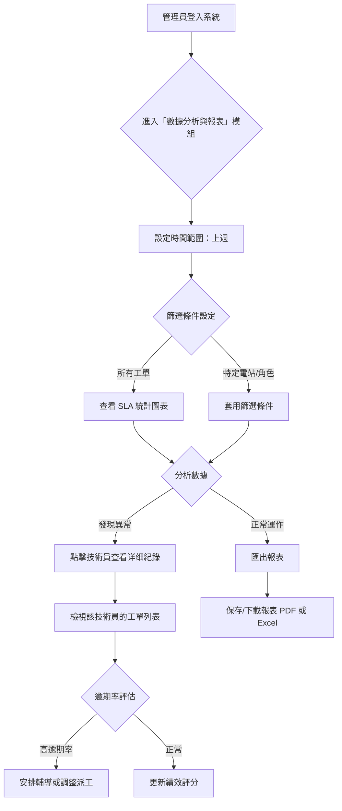

# 太陽能儲能管理系統 - 使用情境 D：管理審核 (Desktop Wireframe)

**版本：** v1.0  
**日期：** 2026-04-30  
**作者：** Hermes Agent

---

## 1. 設計目標
模擬「管理員檢視工單處理效率」到「評估團隊表現並進行績效分析」的完整桌面端操作流程。

## 2. 業務流程圖 (Mermaid)



---

## 3. 介面佈局架構 (Layout)

- **Sidebar (左側導覽)**: 
    - `Dashboard` (儀表板)
    - `Work Orders` (工單管理)
    - `Equipment` (設備監控)
    - `Customers` (客戶管理)
    - **`Analytics` (數據分析與報表 - 當前頁面)** ⭐
    - `Settings` (系統設定)
- **Header (頂部狀態列)**: 
    - `Breadcrumbs`: Analytics / Performance Dashboard
    - `Search Bar`: 全域搜尋
    - `User Profile`: 使用者頭像與名稱 (SA Admin)
- **Main Content Area (主內容區)**: 
    - 使用儀表板式設計，包含多個統計卡片、圖表與數據表格。

---

## 4. ASCII Wireframe - 桌面端佈局示意圖

### 4.1 數據分析儀表板 (Analytics Dashboard)
管理員進入「數據分析與報表」模組時看到的預設畫面：

```
┌─────────────────────────────────────────────────────────────────────────────┐
│  ☰  Solar Storage Mgmt       [🔍 搜尋...]              👤 SA Admin ▼        │
├──────────┬──────────────────────────────────────────────────────────────────┤
│          │  Analytics > Performance Dashboard                               │
│ 📊 Dash- │                                                                  │
│   board  │  ┌─────────────┬─────────────┬─────────────┬─────────────┐       │
│          │  │ 📋 總工單數 │ ✅ 已完成   │ ⏱ 平均處理時│ 🔴 逾期率   │       │
│ 📋 Work- │  │    156      │     132     │   4.2 小時  │    5.1%     │       │
│   Orders │  └─────────────┴─────────────┴─────────────┴─────────────┘       │
│          │                                                                  │
│ 📦 Equip-│  ── 時間範圍篩選器 ──────────────────────────────────────────────  │
│   ment   │                                                                  │
│          │  [📅 自訂日期範圍 ▼]  [上週 ◀]  [本月]  [本季]  [全年]           │
│          │                                                                  │
│ 👥 Custom-│  ── 多維度篩選器 ───────────────────────────────────────────────  │
│   ers    │                                                                  │
│          │  電站：[所有電站 ▼]   角色：[所有角色 ▼]   狀態：[所有狀態 ▼]     │
│          │  [套用篩選]  [重置]                                              │
│ ⚙️ Analy-│                                                                  │
│   tics   │  ── SLA 處理時效趨勢圖 (折線圖) ────────────────────────────────  │
│   ◀ ACTIVE│                                                                  │
│          │  處理時效 (小時)                                                   │
│          │  8 ┤                                                              │
│          │  6 ┤           ●                                                  │
│          │  4 ┤     ●       ●    ●                                         │
│          │  2 ┤ ●   ●  ●     ●    ●                                        │
│          │  0 ┼────────────────────────────────────                         │
│          │       Mon   Tue   Wed   Thu   Fri   Sat   Sun                   │
│          │                                                                  │
│          │  ── 工單狀態分佈 (圓餅圖) ───────────────────────────────────────  │
│          │                                                                  │
│          │     ┌─────────┐                                                   │
│          │     │         │   已完成: 84.6%                                  │
│          │     │    ●────┤   處理中: 10.9%                                  │
│          │     │         │   待處理:  4.5%                                  │
│          │     └─────────┘                                                   │
│          │                                                                  │
│          │  ── 各電站工單數量 (柱狀圖) ─────────────────────────────────────  │
│          │                                                                  │
│          │  60 ┤████                                                        │
│          │  45 ┤████   ████                                                  │
│          │  30 ┤████   ████   ████                                          │
│          │  15 ┤████   ████   ████   ████                                   │
│          │    0 ┼──────┬────────┬────────┬────────┬────────                │
│          │       Green  Blue    Red     Yellow   Purple                     │
│          │       Energy  Solar   Wind                 Solar                │
│          │                                                                  │
│          │  ── 技術員績效排行 (表格) ───────────────────────────────────────  │
│          │                                                                  │
│          │  ┌───────────────────────────────────────────────────────────┐   │
│          │  │ # │ 技術員    │ 完成工單 │ 平均時效 │ 逾期率 │ SLA 達成率│   │   │
│          │  ├───────────────────────────────────────────────────────────┤   │
│          │  │ 1 │ 李技術員 │    28    │  3.2h   │  0%   │  100%   │   │   │
│          │  │ 2 │ 王技術員 │    25    │  3.8h   │  4%   │   96%   │   │   │
│          │  │ 3 │ 陳技術員 │    22    │  5.1h   │  18%  │   82%   │ ← 點擊查看                              │
│          │  │ 4 │ 張技術員 │    20    │  4.5h   │  10%  │   90%   │   │   │
│          │  └───────────────────────────────────────────────────────────┘   │
│          │                                                                  │
│          │  [匯出 PDF]  [匯出 Excel]  [自動排程報表 >]                      │
│          └──────────────────────────────────────────────────────────────────┤
└─────────────────────────────────────────────────────────────────────────────┘
```

### 4.2 技術員詳細紀錄頁面 (Technician Detail View)
點擊「陳技術員」後看到的詳細績效分析：

```
┌─────────────────────────────────────────────────────────────────────────────┐
│  ☰  Solar Storage Mgmt       [🔍 搜尋...]              👤 SA Admin ▼        │
├──────────┬──────────────────────────────────────────────────────────────────┤
│          │  Analytics > Technician Detail: 陳技術員                         │
│ 📊 Dash- │                                                                  │
│   board  │  ← 返回績效排行                                                    │
│          │                                                                  │
│          │  ┌─────────────┬─────────────┬─────────────┬─────────────┐       │
│          │  │ 📋 總工單數 │ ✅ 已完成   │ ⏱ 平均處理時│ 🔴 逾期率   │       │
│          │  │    22       │     18      │   5.1 小時  │    18%      │       │
│          │  └─────────────┴─────────────┴─────────────┴─────────────┘       │
│          │                                                                  │
│          │  ── 每週工單數量趨勢 (柱狀圖) ───────────────────────────────────  │
│          │                                                                  │
│          │  10 ┤████                                                        │
│          │   8 ┤████   ████                                                  │
│          │   6 ┤████   ████   ████                                          │
│          │   4 ┤████   ████   ████   ████                                   │
│          │   2 ┤████   ████   ████   ████                                   │
│          │   0 ┼──────┬────────┬────────┬────────┬────────                │
│          │       W1     W2        W3        W4                                  │
│          │                                                                  │
│          │  ── 工單逾期分佈 (圓餅圖) ───────────────────────────────────────  │
│          │                                                                  │
│          │     ┌─────────┐                                                   │
│          │     │         │   未逾期: 82%                                    │
│          │     │    ●────┤   逾期: 18%                                      │
│          │     │         │                                                   │
│          │     └─────────┘                                                   │
│          │                                                                  │
│          │  ── 逾期工單列表 (表格) ────────────────────────────────────────  │
│          │                                                                  │
│          │  ┌───────────────────────────────────────────────────────────┐   │
│          │  │ ID      │ 標題            │ 電站         │ 逾期天數│ 操作  │   │
│          │  ├───────────────────────────────────────────────────────────┤   │
│          │  │ WO-... │ 電池模組更換    │ Blue Solar   │  2 天  │ [查看]│   │
│          │  │ WO-... │ 變流器故障      │ Red Wind     │  1 天  │ [查看]│   │
│          │  │ WO-... │ 網關通訊中斷    │ Green Energy │  3 天  │ [查看]│   │
│          │  └───────────────────────────────────────────────────────────┘   │
│          │                                                                  │
│          │  [安排輔導]  [調整派工優先級]  [更新績效評分]                    │
│          └──────────────────────────────────────────────────────────────────┤
└─────────────────────────────────────────────────────────────────────────────┘
```

### 4.3 匯出報表彈窗 (Export Report Modal)
點擊「匯出 PDF」或「匯出 Excel」後彈出的對話框：

```
┌─────────────────────────────────────────────────────┐
│  📤 匯出報表                                [X]    │
├─────────────────────────────────────────────────────┤
│                                                     │
│  ── 報表設定 ──                                     │
│                                                     │
│  報表類型：                                         │
│  ○ 工單處理效率分析                                 │
│  ● 技術員績效報告                                   │
│  ○ 電站設備故障統計                                 │
│  ○ 自訂報表                                       │
│                                                     │
│  時間範圍：                                         │
│  [📅 2026-04-24] 至 [📅 2026-04-30]                 │
│                                                     │
│  包含資料：                                         │
│  ☑ 工單基本資訊                                    │
│  ☑ 處理時效統計                                    │
│  ☑ 技術員績效評分                                  │
│  ☐ 設備詳細資訊                                    │
│  ☐ 客戶聯絡記錄                                    │
│                                                     │
│  格式：                                             │
│  (● PDF)  (○ Excel)  (○ CSV)                      │
│                                                     │
├─────────────────────────────────────────────────────┤
│  [取消]                              [匯出並下載]    │
└─────────────────────────────────────────────────────┘
```

---

## 5. 詳細介面元素設計 (Wireframe Details)

### 5.1 數據分析儀表板 (Analytics Dashboard View)
當管理員進入 `Analytics` 模組時，看到的預設畫面。

| 元素 | 設計說明 |
|------|----------|
| **統計卡片**：四個主要 KPI 卡片（總工單數、已完成、平均處理時效、逾期率），每個包含圖示、數值與趨勢箭頭。 |
| **時間範圍篩選器**：快速選擇按鈕（上週、本月、本季、全年）+ 自訂日期範圍選擇器。 |
| **多維度篩選器**：電站、角色、狀態三個下拉選單，支援組合篩選。 |
| **SLA 處理時效趨勢圖**：折線圖，X 軸為日期，Y 軸為處理時效（小時），標示 SLA 閾值線。 |
| **工單狀態分佈圖**：圓餅圖，顯示已完成、處理中、待處理的比例。 |
| **各電站工單數量圖**：柱狀圖，比較不同電站的工單負荷。 |
| **技術員績效排行表格**：包含排名、姓名、完成工單數、平均時效、逾期率、SLA 達成率。點擊姓名可查看詳細紀錄。 |
| **匯出按鈕**：「匯出 PDF」和「匯出 Excel」，支援自動排程報表設定。 |

### 5.2 技術員詳細紀錄頁面 (Technician Detail View)
點擊績效排行表格中的技術員姓名後看到的詳細分析。

| 區塊 | 內容說明 |
|------|----------|
| **統計卡片**：該技術員的個人 KPI（總工單數、已完成、平均處理時效、逾期率）。 |
| **每週工單數量趨勢圖**：柱狀圖，顯示該技術員過去四周的工單處理量。 |
| **工單逾期分佈圖**：圓餅圖，顯示未逾期與逾期的比例。 |
| **逾期工單列表**：表格列出所有逾期工單，包含 ID、標題、電站、逾期天數，可點擊「查看」查看詳情。 |
| **操作按鈕**：「安排輔導」、「調整派工優先級」、「更新績效評分」。 |

### 5.3 匯出報表彈窗 (Export Report Modal)
點擊「匯出 PDF」或「匯出 Excel」後彈出的對話框。

| 區塊 | 內容說明 |
|------|----------|
| **報表類型**：單選按鈕組（工單處理效率分析、技術員績效報告、電站設備故障統計、自訂報表）。 |
| **時間範圍**：日期選擇器，設定起始與結束日期。 |
| **包含資料**：勾選框組，選擇要包含在報表中的資料項目。 |
| **格式**：單選按鈕（PDF / Excel / CSV）。 |
| **底部按鈕**：「取消」和「匯出並下載」（Primary Action）。 |

---

## 6. 使用者路徑模擬 (User Path)

1. **進入** → 登入系統 → 點擊左側 `Analytics`。
2. **設定** → 選擇時間範圍（如「上週」）→ 套用多維度篩選器。
3. **分析** → 查看四個 KPI 卡片、SLA 趨勢圖、狀態分佈圖、電站負荷圖。
4. **發現** → 在技術員績效排行中，發現「陳技術員」逾期率達 18%。
5. **深入** → 點擊「陳技術員」，進入詳細紀錄頁面。
6. **檢視** → 查看該技術員的每週工單趨勢、逾期分佈、逾期工單列表。
7. **行動** → 點擊「安排輔導」或「調整派工優先級」。
8. **匯出** → 點擊「匯出 PDF」→ 設定報表選項 → 下載報表檔案。

---

## 7. 管理員特殊設計考量 (Admin-Specific Considerations)

### 7.1 數據即時性
- **自動更新**：儀表板數據每 5 分鐘自動刷新，確保管理員看到的是最新狀態。
- **手動刷新**：提供「立即刷新」按鈕，讓管理員可手動更新數據。

### 7.2 報表自動化
- **自動排程**：支援設定每週/每月自動生成並發送報表至指定郵箱。
- **歷史查詢**：可查詢過去任意時間段的歷史報表數據。

### 7.3 權限控制
- **管理員**：可查看全公司所有數據與報表。
- **客服主管**：僅可查看所屬團隊的數據與報表。
- **技術員**：僅可查看自己的績效數據（透過行動端）。

---

## 8. 與其他情境的銜接 (Cross-Case Connection)

| 步驟 | 情境 D（管理審核）→ | 其他情境 |
|------|-------------------|----------|
| 1 | 管理員發現技術員逾期率過高 | → | 情境 C：調整該技術員的派工優先級 |
| 2 | 管理員安排輔導後，更新績效評分 | → | 情境 A：客服主管查看新的績效分佈 |
| 3 | 匯出的技術員績效報告作為考核依據 | → | 情境 B：系統根據績效調整告警分派規則 |
| 4 | 自動排程報表每週發送給管理層 | → | 情境 A：客服主管收到週報並進行團隊會議 |

---
**文件結束**
